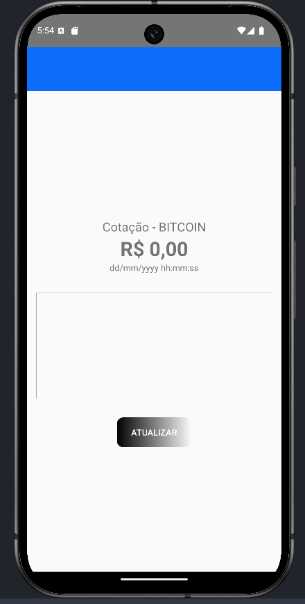
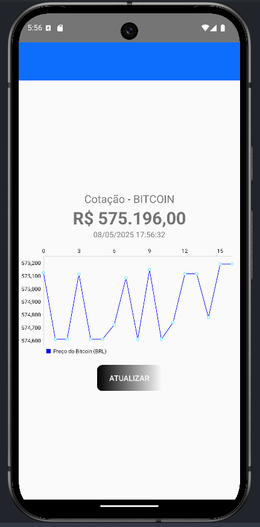

# MonitorCrypto - Acompanhe o preço do Bitcoin

## Sobre o projeto

Oi! O MonitorCrypto é um aplicativo Android que eu fiz pra ajudar a acompanhar o preço do Bitcoin de forma simples. Ele busca o preço atual direto da API do Mercado Bitcoin, mostra o valor em reais (BRL), a data da última atualização e ainda tem um gráfico pra você ver como o preço tá mudando ao longo do tempo. Pra atualizar os dados, é só clicar no botão "Atualizar" na tela!

Eu criei esse app pra aprender mais sobre Android, APIs e gráficos, e espero que ele seja útil pra quem quer acompanhar o Bitcoin de um jeito fácil.

---

## O que o app faz?

- **Mostra o preço do Bitcoin**: Busca o valor mais recente do Bitcoin e exibe em reais.
- **Data da atualização**: Mostra a data e hora em que o preço foi atualizado.
- **Gráfico de variação**: Tem um gráfico que desenha uma linha pra mostrar como o preço mudou.
- **Botão de atualizar**: Clica no botão e o app pega os dados novos pra você.

---

## Como o projeto foi organizado?

O app tem alguns arquivos importantes que trabalham juntos pra fazer tudo funcionar:

- **`MainActivity.kt`**: É o "cérebro" do app, onde controlo a tela e faço as coisas acontecerem.
- **`MercadoBitcoinService.kt`**: É como uma ponte pra conversar com a API.
- **`MercadoBitcoinServiceFactory.kt`**: Configura a "ponte" pra funcionar direitinho.
- **`TickerResponse.kt`**: Organiza os dados que a API manda pra gente.
- **`activity_main.xml` e `component_quote_information.xml`**: São os arquivos que desenham a tela, com o botão, os textos e o gráfico.

---

## Explicando como funciona (bem simples!)

### 1. Pegando os dados do Bitcoin
O app precisa falar com a internet pra pegar o preço do Bitcoin. Pra isso, usei uma ferramenta chamada Retrofit, que é tipo um "carteiro" que leva nosso pedido pra API e traz a resposta.

No arquivo `MercadoBitcoinService.kt`, eu disse pro Retrofit onde ele deve ir buscar os dados:

```kotlin
interface MercadoBitcoinService {
    @GET("api/BTC/ticker/")
    suspend fun getTicker(): Response<TickerResponse>
}
```

- **`interface`**: É como um contrato que diz o que o app pode pedir pra API.
- **`@GET("api/BTC/ticker/")`**: Isso diz que queremos buscar os dados do Bitcoin nesse endereço específico da API.
- **`suspend fun getTicker()`**: Essa função faz o pedido e espera a resposta.
- **`Response<TickerResponse>`**: A resposta vem como um pacote que a gente vai abrir depois.

No `MercadoBitcoinServiceFactory.kt`, configurei o "carteiro" pra saber onde ir e como trazer os dados:

```kotlin
class MercadoBitcoinServiceFactory {
    fun create(): MercadoBitcoinService {
        val retrofit = Retrofit.Builder()
            .baseUrl("https://www.mercadobitcoin.net/")
            .addConverterFactory(GsonConverterFactory.create())
            .build()
        return retrofit.create(MercadoBitcoinService::class.java)
    }
}
```

- **`baseUrl`**: É o endereço principal do Mercado Bitcoin na internet.
- **`addConverterFactory(GsonConverterFactory.create())`**: Isso transforma a resposta da API (que vem como texto) em algo que o app entende.
- **`retrofit.create`**: Cria o "carteiro" pronto pra trabalhar.

Agora, na `MainActivity.kt`, eu uso esse "carteiro" pra pedir os dados e mostrar na tela. Olha a função `makeRestCall()`:

```kotlin
private fun makeRestCall() {
    CoroutineScope(Dispatchers.Main).launch {
        try {
            val service = MercadoBitcoinServiceFactory().create()
            val response = service.getTicker()
            if (response.isSuccessful) {
                val tickerResponse = response.body()
                val lblValue: TextView = findViewById(R.id.lbl_value)
                val lblDate: TextView = findViewById(R.id.lbl_date)
                val lastValue = tickerResponse?.ticker?.last?.toDoubleOrNull()
                if (lastValue != null) {
                    val numberFormat = NumberFormat.getCurrencyInstance(Locale("pt", "BR"))
                    lblValue.text = numberFormat.format(lastValue)
                    updateChart(lastValue.toFloat())
                }
                val date = tickerResponse?.ticker?.date?.let { Date(it * 1000L) }
                val sdf = SimpleDateFormat("dd/MM/yyyy HH:mm:ss", Locale.getDefault())
                lblDate.text = sdf.format(date)
            } else {
                val errorMessage = when (response.code()) {
                    400 -> "Bad Request"
                    401 -> "Unauthorized"
                    403 -> "Forbidden"
                    404 -> "Not Found"
                    else -> "Unknown error"
                }
                Toast.makeText(this@MainActivity, errorMessage, Toast.LENGTH_LONG).show()
            }
        } catch (e: Exception) {
            Toast.makeText(this@MainActivity, "Algo deu errado: ${e.message}", Toast.LENGTH_LONG).show()
        }
    }
}
```

- **`CoroutineScope(Dispatchers.Main).launch`**: Isso faz o pedido sem travar o app, e a resposta aparece na tela principal.
- **`service.getTicker()`**: Aqui o "carteiro" vai buscar os dados.
- **`response.isSuccessful`**: Verifica se a API respondeu direitinho.
- **`lblValue.text`**: Coloca o preço do Bitcoin na tela, já formatado como reais (ex.: R$ 100.000,00).
- **`updateChart(lastValue.toFloat())`**: Chama a função pra atualizar o gráfico com o novo preço.
- **`lblDate.text`**: Mostra a data e hora da atualização.
- **`Toast.makeText`**: Se der algum erro, o app mostra uma mensagem pra avisar.

### 2. Desenhando o gráfico
Eu queria mostrar como o preço do Bitcoin muda com o tempo, então usei uma biblioteca chamada MPAndroidChart pra criar um gráfico de linha. Primeiro, adicionei o gráfico na tela, no arquivo `component_quote_information.xml`:

```xml
<com.github.mikephil.charting.charts.LineChart
    android:id="@+id/price_chart"
    android:layout_width="match_parent"
    android:layout_height="200dp"
    android:layout_marginTop="16dp" />
```

- **`LineChart`**: É o tipo de gráfico, uma linha que conecta os preços.
- **`android:id="@+id/price_chart"`**: Um nome pra eu encontrar o gráfico no código.
- **`layout_width` e `layout_height`**: Define o tamanho do gráfico na tela.

Na `MainActivity.kt`, configurei o gráfico e atualizo ele com os preços novos. Primeiro, criei uma lista pra guardar os preços:

```kotlin
private val priceHistory = mutableListOf<Float>()
private lateinit var priceChart: LineChart
```

- **`priceHistory`**: Uma lista que guarda todos os preços que o app já pegou.
- **`priceChart`**: O gráfico que vou usar pra mostrar os preços.

Depois, configurei o gráfico com a função `setupChart()`:

```kotlin
private fun setupChart() {
    priceChart.description.isEnabled = false
    priceChart.setTouchEnabled(true)
    priceChart.isDragEnabled = true
    priceChart.setScaleEnabled(true)
    priceChart.setPinchZoom(true)
    priceChart.xAxis.setDrawGridLines(false)
    priceChart.xAxis.setDrawLabels(true)
    priceChart.axisLeft.setDrawGridLines(false)
    priceChart.axisRight.isEnabled = false
    val lineData = LineData()
    priceChart.data = lineData
    priceChart.invalidate()
}
```

- **`description.isEnabled = false`**: Tira uma descrição padrão que o gráfico mostra.
- **`setTouchEnabled`, `isDragEnabled`, `setScaleEnabled`, `setPinchZoom`**: Isso deixa o usuário mexer no gráfico (dar zoom, arrastar).
- **`xAxis` e `axisLeft`**: São os eixos do gráfico (o X é horizontal, o Y é vertical). Desativei algumas linhas pra deixar mais limpo.
- **`axisRight.isEnabled = false`**: Tirei o eixo da direita pra não ficar confuso.
- **`priceChart.invalidate()`**: Diz pro gráfico "se desenha de novo!".

Por último, a função `updateChart()` adiciona os preços novos ao gráfico:

```kotlin
private fun updateChart(newPrice: Float) {
    priceHistory.add(newPrice)
    if (priceHistory.size > 50) {
        priceHistory.removeAt(0)
    }
    val entries = priceHistory.mapIndexed { index, price ->
        Entry(index.toFloat(), price)
    }
    val dataSet = LineDataSet(entries, "Preço do Bitcoin (BRL)")
    dataSet.color = android.graphics.Color.BLUE
    dataSet.setDrawCircles(true)
    dataSet.setDrawValues(false)
    val lineData = LineData(dataSet)
    priceChart.data = lineData
    priceChart.invalidate()
}
```

- **`priceHistory.add(newPrice)`**: Adiciona o novo preço à lista.
- **`if (priceHistory.size > 50)`**: Se a lista tiver mais de 50 preços, remove o mais antigo pra não ficar muito pesado.
- **`Entry(index.toFloat(), price)`**: Cada preço vira um ponto no gráfico (o `index` é a posição no tempo, o `price` é o valor).
- **`LineDataSet(entries, "Preço do Bitcoin (BRL)")`**: Junta todos os pontos pra formar a linha do gráfico.
- **`dataSet.color = android.graphics.Color.BLUE`**: Faz a linha ser azul.
- **`setDrawCircles(true)`**: Coloca um pontinho em cada preço.
- **`setDrawValues(false)`**: Não mostra os números em cima dos pontos (pra não ficar bagunçado).
- **`priceChart.invalidate()`**: Atualiza o gráfico com os novos dados.

---

## Imagens do app

### Tela inicial
Quando você abre o app, a tela tá vazia, só esperando você clicar no botão "Atualizar".




### Tela com os valores
Depois de clicar em "Atualizar", o app mostra o preço do Bitcoin, a data e o gráfico com a variação.




---

## Como usar o app?

1. Baixe o projeto:
   ```bash
   git clone https://github.com/Minks2/androidCrypto.git
   ```
2. Abra no Android Studio.
3. Clique em "Sync Project with Gradle Files" pra baixar tudo que o app precisa.
4. Conecte um celular Android ou use um emulador.
5. Clique em "Run" no Android Studio pra abrir o app.
6. Clique no botão "Atualizar" pra ver o preço do Bitcoin!

---

## Ferramentas que usei

- **Retrofit**: Pra buscar os dados na internet.
- **Gson Converter**: Pra transformar os dados em algo que o app entende.
- **MPAndroidChart**: Pra criar o gráfico.
- **Kotlin Coroutines**: Pra fazer as coisas sem travar o app.

---

### 🧩 Dependências utilizadas

O projeto utiliza as seguintes bibliotecas:

- `androidx.appcompat:appcompat:1.7.0`  
  Suporte à compatibilidade com versões antigas do Android.

- `androidx.activity:activity-ktx:1.7.0`  
  Extensões Kotlin para trabalhar com Activities de forma mais concisa.

- `com.squareup.retrofit2:retrofit:2.9.0`  
  Para realizar requisições HTTP e consumir APIs REST.

- `com.squareup.retrofit2:converter-gson:2.9.0`  
  Para converter respostas JSON da API em objetos Kotlin usando Gson.

- `org.jetbrains.kotlinx:kotlinx-coroutines-android:1.5.2`  
  Para rodar chamadas assíncronas sem travar a interface do app (UI).

- `com.github.PhilJay:MPAndroidChart:v3.1.0`  
  Para gerar o gráfico de linha com a variação de preço do Bitcoin.

> Obs: o repositório JitPack foi adicionado no `settings.gradle.kts` para importar a biblioteca de gráficos:

maven { url = uri("https://jitpack.io") }

## Ideias pra melhorar

- Colocar outras moedas.
- Mostrar as datas no gráfico.
- Fazer o app atualizar sozinho a cada 30 segundos.

---

## Dificuldades enfrentadas

- Aprender novas funcionalidades.
- Importar as bibliotecas corretamente e incluir as dependências no local correto:

na `settings.gradle.kts`, precisei adicionar o link:
```kotlin
dependencyResolutionManagement {
    repositoriesMode.set(RepositoriesMode.FAIL_ON_PROJECT_REPOS)
    repositories {
        google()
        mavenCentral()
        maven { url = uri("https://jitpack.io") }
    }
}
```
- **` maven { url = uri("https://jitpack.io")`**: 
---

Feito por Caio Sales Dias 😊
